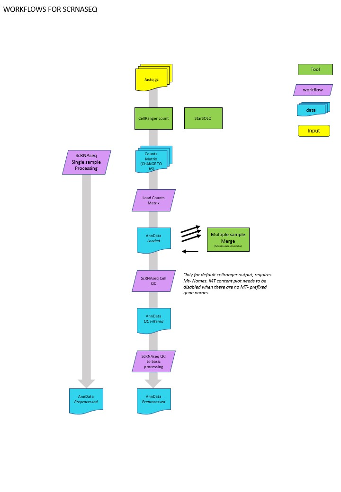

scRNAseq Processing Workflows
==============

# General recommendations

This document describes how to use some scanpy-based scRNAseq workflows on galaxy Australia. 

The aim of these workflows is to handle the routine ‘boring’ part of single cell RNAseq data processing. It will produces an ‘AnnData’ object, which can then be used as a base for downstream analysis – either within galaxy or outside of it. AnnData is a standard format used by the ‘scanpy’ python package. 

These workflows represent just one way of processing data for a ‘typical’ scRNAseq experiment – there are many other options!  

---

This document describes 3 sub-workflows for processing single cell RNAseq data with scanpy 

Load counts matrix:  

https://usegalaxy.org.au/u/s.williams/w/scrnaseq-load-counts-matrix-subworkflow   

This workflow adds a sample name, which enables multi-sample analyses 

Single cell QC:  

https://usegalaxy.org.au/u/s.williams/w/scrnaseqcellqc   

This workflow generates some basic QC plots and applies filtering 

Single cell QC to basic processing:  

https://usegalaxy.org.au/u/s.williams/w/copy-of-scanpyqcplusdraft  

This generates a UMAP, does clustering and calculates cluster marker genes. 

 
For single sample experiments, there is a streamlined workflow that runs all 3 sub-workflows all at once 

Single sample workflow:  

https://usegalaxy.org.au/u/s.williams/w/copy-of-scrnaseqcountsmatrixtoqc  

 

